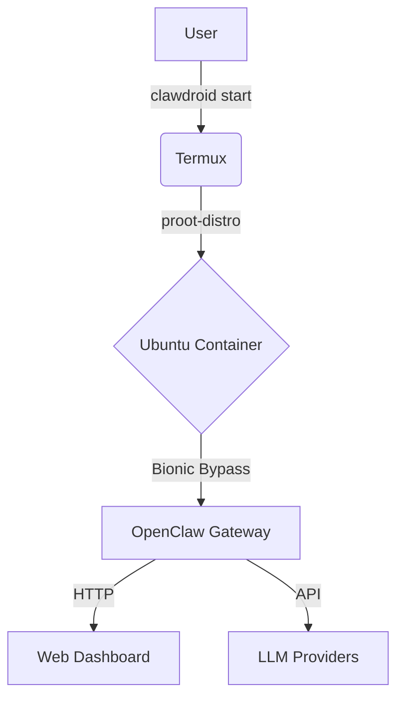

# ClawDroid 🤖

> **Run OpenClaw AI Gateway on Android via Termux**
> One-command setup. Optimized for mobile. Bionic Bypass included.


**ClawDroid** makes running [OpenClaw](https://github.com/openclaw/openclaw) on Android effortless. It handles the environment setup (proot-distro, Ubuntu, Node.js) and fixes Android-specific issues automatically.

## 🚀 Why ClawDroid?

Running standard Node.js AI tools on Android is painful because of:
*   **Bionic libc**: Android's C library differs from Linux (glibc), breaking `os.networkInterfaces()` and DNS lookups.
*   **Permissions**: Termux has restricted access to system resources.
*   **Environment**: Many tools expect a full Linux userland (Ubuntu/Debian).

**ClawDroid solves this by:**
1.  Creating a lightweight **Ubuntu** container inside Termux.
2.  Injecting a **Bionic Bypass** script to fix networking.
3.  Providing a simple CLI (`clawdroid`) to manage the gateway.

## 📦 Installation

### Prerequisites
*   **Android 10+**
*   **Termux** (Install from [F-Droid](https://f-droid.org/packages/com.termux/), NOT Play Store)
*   ~2GB free storage

### One-Command Setup
Open Termux and run:

```bash
curl -fsSL https://raw.githubusercontent.com/NOSYTLABS/clawdroid/main/install.sh | bash
```

Or via npm:

```bash
npm install -g clawdroid
clawdroid setup
```

## 🎮 Usage

### 1. Initialize
First, configure your API keys:

```bash
clawdroid onboarding
```
> **IMPORTANT:** Select **Loopback (127.0.0.1)** for Binding.

### 2. Start Gateway
Launch the OpenClaw gateway:

```bash
clawdroid start
```
The dashboard will be available at: **http://127.0.0.1:18789**

### 3. Other Commands

| Command | Description |
| :--- | :--- |
| `clawdroid status` | Check installation health |
| `clawdroid update` | Update OpenClaw to the latest version |
| `clawdroid shell` | Open the Ubuntu shell |
| `clawdroid repair` | Re-install dependencies if broken |
| `clawdroid <cmd>` | Run any OpenClaw command (e.g., `clawdroid doctor`) |

## 🧩 Architecture



## ⚠️ Troubleshooting

**"Setup not complete" error**
*   Run `clawdroid setup` again.
*   If it persists, run `clawdroid repair`.

**Process killed in background**
*   Go to Android Settings → Apps → Termux → Battery → **Unrestricted**.

## 📜 License

MIT License.
